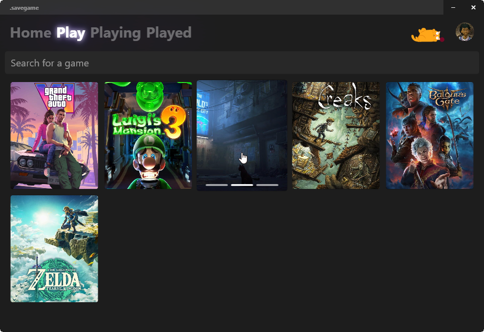

https://github.com/rohanharikr/SaveGame/assets/12775813/a1dd9f62-d008-423e-80a6-b228f7fc546a

# .savegame

Keep track of your games!  
Powered by C#/.NET WPF, IGDB, LiteDB.

## Tech

SaveGame is a windows desktop application powered by:
- C#/.NET WPF
- MVVM via [CommunityToolkit.Mvvm](https://www.nuget.org/packages/CommunityToolkit.Mvvm)
- Dependency Injection via [Extensions.Hosting](https://www.nuget.org/packages/Microsoft.Extensions.Hosting)
- IGDB API via [igdb-dotnet](https://github.com/kamranayub/igdb-dotnet)
- Lottie JSON animations via [LottieSharp](https://github.com/quicoli/LottieSharp)
- Persistent (NoSQL) data via [LiteDB](https://www.litedb.org/)

## Screenshots




## Building or Running your own .savegame application

#### Pre-requisities
1. Visual Studio or other IDE
1. .NET 8.0
1. Twitch Client ID and Secrets for IGDB API authentication (Obtain from [Twitch Developer Console](https://dev.twitch.tv/console/apps))
1. [Optional] WinAppDriver for UI test automation (Download [here](https://github.com/microsoft/WinAppDriver?tab=readme-ov-file#install--run-winappdriver))

#### Build or Run with environment variables:
```shell
export IGDB_CLIENT_ID=[your OAuth app client ID]
export IGDB_CLIENT_SECRET=[your OAuth app clien